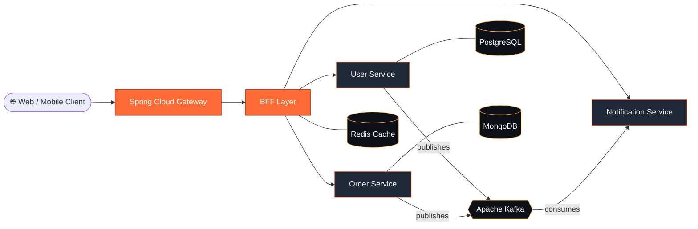

<!-- ============================ HEADER ============================ -->
<div align="center">


<a href="https://github.com/MengseuThoeng">
  
</a>

<br/><br/>

<a href="https://mengseu-thoeng.vercel.app"></a>
<a href="https://www.linkedin.com/in/thoeng-mengseu-273b9b312/"></a>
<a href="mailto:mengseu2004@gmail.com"></a>
<a href="https://web.facebook.com/mengseu.thoeng/"></a>


</div>

<br/>

<!-- ============================ ABOUT ============================ -->
## 👨‍💻 About Me

<table>
<tr>
<td width="55%" valign="top">

I'm a **software engineer** who loves turning complex business problems into clean, scalable systems. My core is **Spring Boot microservices** and **event-driven architecture**, and I round it out with full-stack web work and a designer's eye for UI/UX.

- 🌏 Based in **Phnom Penh, Cambodia**
- 🎓 Studied at **ISTAD** and **SETEC**
- 🏗️ Building **enterprise microservices** and distributed systems
- 📚 Learning **Spring Cloud Gateway · Kafka Streams · BFF · Kubernetes**
- 🎨 Designing with **Figma, Photoshop, Premiere & After Effects**
- 💬 Ask me about **Spring Boot, Kafka, API design, clean architecture**

> *"Code is poetry written in logic."* 🎭

</td>
<td width="45%" valign="top" align="center">

```text
╭──────────────────────────────╮
│  🧑‍💻  mengseu@phnom-penh      │
├──────────────────────────────┤
│  role     Software Engineer  │
│  focus    Microservices      │
│  style    Event-Driven       │
│  backend  Java · Spring Boot │
│  front    React · Next.js    │
│  infra    Docker · K8s       │
│  status   🟢 Building        │
╰──────────────────────────────╯
```

</td>
</tr>
</table>

<!-- ============================ FOCUS ============================ -->
## 🎯 Current Focus

<table>
<tr>
<td align="center" width="33%">

### 🏗️ Building
**Enterprise Microservices**<br/>
Spring Cloud · API Gateway<br/>
Distributed Systems

</td>
<td align="center" width="33%">

### 📚 Learning
**Advanced Patterns**<br/>
Event Sourcing & CQRS<br/>
DDD · Clean Architecture

</td>
<td align="center" width="33%">

### 🚀 Exploring
**Next-Gen Tech**<br/>
Reactive Programming<br/>
Cloud Native · AI/ML Integration

</td>
</tr>
</table>

<!-- ============================ ARCHITECTURE ============================ -->
## 🧩 How I Like to Build

GitHub renders this diagram natively, a simplified view of the event-driven architecture I work with:



<!-- ============================ TECH STACK ============================ -->
## ⚡ Tech Stack

<div align="center">

| | |
|:---|:---|
| **⚙️ Backend** |  |
| **🎨 Frontend** |  |
| **🗄️ Data & Messaging** |  |
| **☁️ Cloud & DevOps** |  |
| **🖌️ Design & Creative** |  |

</div>

<!-- ============================ STATS ============================ -->
## 📊 GitHub Stats

<div align="center">

<a href="https://github.com/MengseuThoeng">
  <picture>
    <source media="(prefers-color-scheme: dark)" srcset="https://github-readme-stats.vercel.app/api?username=MengseuThoeng&show_icons=true&hide_border=true&theme=transparent&title_color=FF6B35&icon_color=FFB347&text_color=C9D1D9&border_radius=14&include_all_commits=true&count_private=true">
    <source media="(prefers-color-scheme: light)" srcset="https://github-readme-stats.vercel.app/api?username=MengseuThoeng&show_icons=true&hide_border=true&theme=transparent&title_color=C63C22&icon_color=FF6B35&text_color=24292F&border_radius=14&include_all_commits=true&count_private=true">
    
  </picture>
  <picture>
    <source media="(prefers-color-scheme: dark)" srcset="https://github-readme-stats.vercel.app/api/top-langs/?username=MengseuThoeng&layout=compact&hide_border=true&theme=transparent&title_color=FF6B35&text_color=C9D1D9&border_radius=14&langs_count=8&hide=html,css">
    <source media="(prefers-color-scheme: light)" srcset="https://github-readme-stats.vercel.app/api/top-langs/?username=MengseuThoeng&layout=compact&hide_border=true&theme=transparent&title_color=C63C22&text_color=24292F&border_radius=14&langs_count=8&hide=html,css">
    
  </picture>
</a>

<br/>

<picture>
  <source media="(prefers-color-scheme: dark)" srcset="https://streak-stats.demolab.com/?user=MengseuThoeng&theme=transparent&hide_border=true&ring=FF6B35&fire=FF6B35&currStreakLabel=FFB347&sideLabels=C9D1D9&currStreakNum=C9D1D9&sideNums=C9D1D9&dates=8B949E&border_radius=14">
  <source media="(prefers-color-scheme: light)" srcset="https://streak-stats.demolab.com/?user=MengseuThoeng&theme=transparent&hide_border=true&ring=C63C22&fire=FF6B35&currStreakLabel=C63C22&sideLabels=24292F&currStreakNum=24292F&sideNums=24292F&dates=57606A&border_radius=14">
  
</picture>

<br/><br/>


</div>


<details>
<summary><b>🐍 Contribution snake</b> (click to expand)</summary>
<br/>
<div align="center">
  
</div>
</details>

<!-- ============================ COLLAB ============================ -->
## 🤝 Let's Collaborate

<div align="center">

| 🏗️ Microservices | 🌐 Full Stack | 🎨 UI/UX Design | 🚀 Open Source |
|:---:|:---:|:---:|:---:|
| Spring Boot<br/>Event-Driven Systems | Modern Web Apps<br/>Cloud-Native Solutions | Digital Experiences<br/>Brand Identity | Community<br/>Knowledge Sharing |

<br/>

**Got an idea or a project? Let's talk.**

<a href="mailto:mengseu2004@gmail.com"></a>
<a href="https://mengseu-thoeng.me"></a>

</div>

<!-- ============================ FOOTER ============================ -->


<div align="center">
  <sub>⭐ Building the future, one commit at a time · Made with ❤️ by <b>Mengseu Thoeng</b></sub>
</div>
